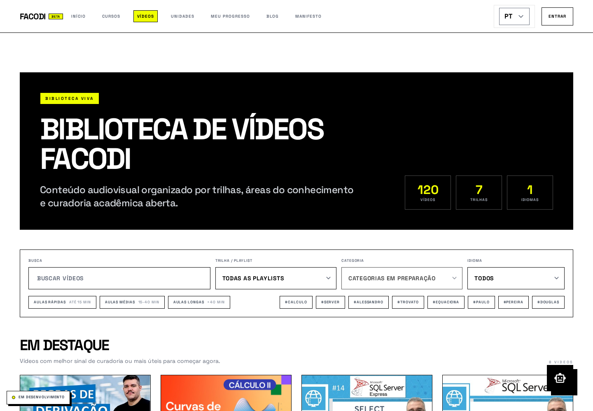
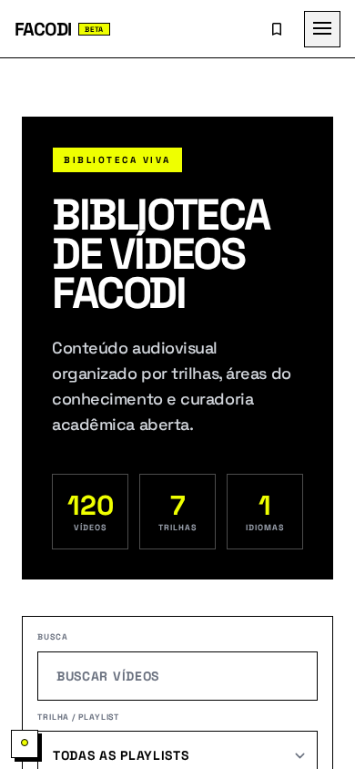

# FACODI - Faculdade Comunitaria Digital

FACODI e uma plataforma educacional aberta para organizar curriculos, unidades curriculares e trilhas de estudo com conteudos publicos.

Projeto mantido por Open2 Technology: https://open2.tech

## Visao Geral

- SPA em React 19 + TypeScript + Vite.
- Catalogo academico com cursos, unidades curriculares e playlists.
- Biblioteca publica de videos com busca, filtros persistidos na URL e secoes de descoberta.
- Fluxos de autenticacao, perfil, progresso e historico de estudos.
- Areas dedicadas para curadoria, pipeline editorial e administracao.
- Conteudo institucional e blog em Markdown.
- Suite de testes E2E com Playwright.

## Capturas de Tela

### Biblioteca de Videos

Experiencia publica em `/videos`, com hero de biblioteca, metricas, filtros por trilha, idioma e duracao, tags sugeridas e rails de descoberta.

| Desktop | Mobile |
| --- | --- |
|  |  |

## Arquitetura Atual

- Frontend: React + TypeScript.
- Build e dev server: Vite.
- Dados: Supabase schema `facodi` como fonte canonica de catalogo e classificacao.
- Persistencia e auth: Supabase (schemas `facodi` e `public` + RLS).
- Contrato de catalogo centralizado em `services/catalogSource.ts`.
- Navegacao global centralizada em `navigation.ts`, usada por menu desktop, menu mobile e footer.
- Mutacoes de video e pipeline via Edge Functions `v2_*`.

Principio arquitetural: componentes devem consumir o catalogo via `loadCatalogData()`, que le exclusivamente os read models do schema `facodi`.

## Modos de Dados

O catalogo usa as views publicas do schema `facodi`:

- `facodi.v_catalog_courses`
- `facodi.v_catalog_units`
- `facodi.v_catalog_playlists`
- `facodi.v_public_videos`
- `facodi.v_playlist_videos`

Fluxos de video usam `/videos/submit`, `/videos/submit/:jobId` e `/curator/channel-pipeline`.
O frontend nao deve chamar slugs antigos de video/canal; veja `docs/FACODI_V2_VIDEO_PIPELINE.md`.

## Setup Rapido

Requisitos:

- Node.js 20+
- Corepack habilitado
- pnpm 10.17.1 (fixado em `packageManager`)

Execucao local:

```bash
corepack enable
pnpm install
cp .env.example .env.local
pnpm dev
```

## Scripts

- `pnpm dev`: inicia ambiente local (porta 3000).
- `pnpm build`: gera build de producao.
- `pnpm preview`: sobe preview local da build.
- `pnpm test:e2e`: executa testes end-to-end.
- `pnpm security:check-rls`: valida RLS no banco alvo.

Em maquinas novas para E2E:

```bash
pnpm exec playwright install
```

## Deploy

O deploy do frontend usa Nixpacks com Node/pnpm, configurado em `nixpacks.toml`.
Esse arquivo e intencional: o repositorio tambem possui `deno.json` e Supabase Edge Functions,
mas a aplicacao web publica e um SPA Vite/React e deve ser buildada com `pnpm build`.

No Coolify, mantenha a raiz do app apontando para este repositorio/pasta e deixe o Nixpacks ler
`nixpacks.toml`; ele instala dependencias com `pnpm install --frozen-lockfile`, gera `dist/` e
inicia `pnpm preview` em `0.0.0.0` usando a porta fornecida pelo ambiente.

## Variaveis de Ambiente

Arquivo base: `.env.example`

- `SITE_URL`
- `VITE_SITE_URL`
- `VITE_SUPABASE_URL` (obrigatorio para `supabase`)
- `VITE_SUPABASE_PUBLISHABLE_KEY` (obrigatorio para `supabase`)
- `SUPABASE_DB_URL` (necessario para `pnpm security:check-rls`)

Seguranca:

- Nunca commitar `.env` ou `.env.local`.
- Nunca usar service role key no frontend.
- Nunca consultar `auth.users` no frontend; usar `public.profiles`.

## Estrutura do Repositorio

- `App.tsx`: shell da aplicacao, rotas e bootstrap.
- `components/`: paginas e blocos de UI.
- `contexts/`: estado global (auth e curadoria).
- `hooks/`: logica de progresso, dashboard e cursos.
- `services/`: acesso a dados e integracoes.
- `data/`: traducoes e conteudo estatico nao-catalogo.
- `navigation.ts`: configuracao unica dos links globais, institucionais e de footer.
- `content/`: conteudo institucional/blog.
- `docs/screenshots/`: capturas de tela usadas no README e na documentacao visual.
- `tests/e2e/`: cenarios Playwright.
- `scripts/`: validacoes operacionais.
- `supabase/functions/`: edge functions do projeto.

## Qualidade e Acessibilidade

- Navegacao orientada a teclado com `aria-*` em componentes centrais de layout.
- Testes E2E cobrindo fluxos de estudante, curadoria e detalhe de aula.
- Guardrails de dados para evitar regressao de contratos de catalogo.

## Contratos Criticos

- `Course.id` deve permanecer estavel e unico.
- `CurricularUnit.courseId` deve referenciar `Course.id` valido.
- `Playlist.units` deve permanecer `string[]` com ids validos de unidade.
- Ordenacao de playlists deve ser deterministica.

## Documentacao

- Guia principal do projeto: `docs/FACODI.md`
- Guia tecnico de desenvolvimento: `docs/DEVELOPER_GUIDE.md`
- Pipeline FACODI V2 de videos: `docs/FACODI_V2_VIDEO_PIPELINE.md`
- Baseline de acessibilidade: `docs/ACCESSIBILITY_IMPROVEMENTS.md`
- Capturas de tela do produto: `docs/screenshots/`
- Contribuicao: `CONTRIBUTING.md`
- Guardrails para agentes: `AGENTS.md`

## Instrucoes Tecnicas (AI / Automacao)

- `.github/instructions/odoo-elearning-frontend.instructions.md`
- `.github/instructions/odoo-elearning.instructions.md`
- `.github/instructions/postman-mcp.instructions.md`

## Licenca

MIT
