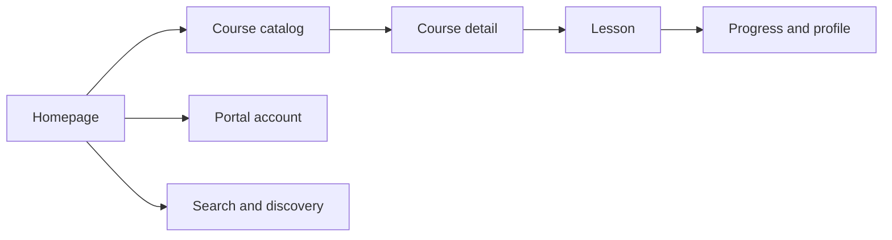

# FACODI Theme


The Odoo 19 Website and eLearning theme for FACODI, Faculdade Comunitaria Digital.

## Objective

`theme_facodi` turns native Odoo Website, eLearning, authentication, search, portal, and cookie surfaces into one coherent FACODI learning experience. It preserves Odoo routes and template behavior through QWeb inheritance and centralizes the visual system in SCSS tokens.

## Problem solved

Native Odoo surfaces are functional but visually fragmented when used as a public learning platform. This theme gives learners a consistent navigation model, course discovery experience, lesson interface, portal account area, and responsive identity without replacing the underlying Odoo applications.

## Features

- FACODI palette: `#EFFF00`, `#000000`, `#FFFFFF`, `#F2F2F2`, and `#666666`.
- Space Grotesk, Inter, and JetBrains Mono typography roles.
- Custom header, footer, homepage, About, Manifesto, Community, Roadmap, and contribution pages.
- Responsive Website Builder Learning Hub snippet.
- eLearning catalog, course, lesson, fullscreen, quiz, comment, share, and profile styling.
- Authentication, reset password, search, empty state, 403/404/500, cookie banner, and portal styling.
- Defensive visual coverage for optional Blog, Events, and Forum surfaces.
- Dynamic homepage course cards sourced from published `slide.channel` records.
- Website Configurator palette and theme preview assets.

## Screenshots

Staging evidence captured from the public Website and portal surfaces is maintained in the repository documentation:

- [Home screenshot](../../../../docs/facodi/screenshots/facodi-home-staging.png)
- [Courses screenshot](../../../../docs/facodi/screenshots/facodi-courses-staging.png)
- [Portal screenshot](../../../../docs/facodi/screenshots/facodi-portal-staging.png)

The addon preview assets are under [`static/description/`](static/description/).

## Functional flow



## Architecture

- `static/src/scss/primary_variables.scss`: Odoo palette maps and FACODI tokens.
- `static/src/scss/bootstrap_overridden.scss`: Bootstrap semantic overrides.
- `static/src/scss/facodi_frontend.scss`: global components, snippets, Website, eLearning, portal, auth, search, and error styles.
- `views/header.xml`, `views/footer.xml`, `views/homepage.xml`: public site chrome and homepage.
- `views/pages.xml`: institutional pages.
- `views/slides_*.xml`: native eLearning template inheritance.
- `views/profile.xml`, `views/auth.xml`: portal and authentication inheritance.
- `views/search_*.xml`, `views/cookies.xml`: global search, error, and privacy surfaces.
- `models/website_page.py`: homepage course context.
- `models/theme_facodi.py`: theme lifecycle integration.
- `data/ir_asset.xml`: frontend asset registration.

## Dependencies

- Odoo 19 Community: `website`, `website_slides`.
- FACODI Content: `facodi_content`.
- No additional Python dependency is declared by the theme.

## Installation

```bash
python3 odoo-bin -d <database> \
  --addons-path=<odoo-core>/addons,odoo/facodi/addons \
  -i theme_facodi --stop-after-init
```

Update the Apps list, install **FACODI Theme**, and select it in Website configuration. Use `-u theme_facodi` to upgrade an existing installation.

## Configuration

1. Install `facodi_content` and `theme_facodi`.
2. Publish eLearning channels to populate the homepage catalogue.
3. Apply the FACODI theme in Website configuration.
4. Review the header menu and institutional pages.
5. Check `/`, `/slides`, a course, a lesson, `/website/search`, `/web/login`, and `/my/home` on desktop and mobile widths.

## Usage

Content editors manage courses, slides, and publication state through the standard Odoo eLearning backend. Website editors compose approved snippets through the native Website Builder. Theme code should remain responsible for presentation and template hooks, not editorial data.

## Integrations

- Odoo Website and Website Builder.
- Odoo eLearning (`website_slides`).
- Odoo Portal and authentication surfaces.
- `facodi_content` collection metadata and enrichment workflow.

## Roadmap

- Add automated visual regression captures for the public route matrix.
- Add rasterized App Store previews generated from approved staging captures.
- Add accessibility checks for keyboard navigation and contrast.
- Add Portuguese and English UI review evidence for all inherited templates.

## Known limitations

- Course cards depend on published `slide.channel` records.
- The theme does not provide production content or credentials.
- Optional Blog, Events, and Forum styling is defensive and requires those apps to be installed for full validation.
- Odoo Website Builder may create per-website view copies that require an upgrade when template hooks change.

## Contribution

Prefer QWeb inheritance over full template replacement, keep the FACODI tokens centralized, add focused visual evidence for new surfaces, and validate SCSS/XML before opening a pull request. Report issues at [github.com/Open2Tech/facodi](https://github.com/Open2Tech/facodi).

## License and authors

Copyright Open2 Technology. Licensed under [LGPL-3](https://www.gnu.org/licenses/lgpl-3.0.html).

Maintained by Open2 Technology: [open2.tech](https://open2.tech).
